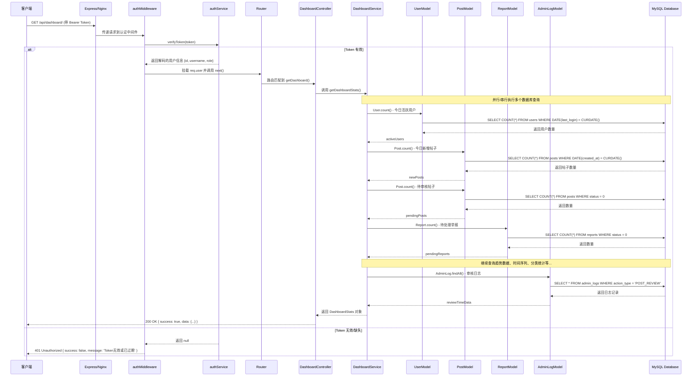

# 学生社区 Dashboard 个人信息查看功能流程分析

## 1. 入口识别

### API 接口信息
- **HTTP 方法**: `GET`
- **完整 URL**: `/api/dashboard/`
- **路由定义文件**: `study-com-platform-be/src/routes/dashboard.routes.ts:8`
- **入口控制器函数**: `dashboard.controller.ts` 中的 `getDashboard` 函数 (第4行)

### 访问控制
该接口需要 JWT 认证，请求头必须包含 `Authorization: Bearer <token>`

---

## 2. 全链路文件清单

| 文件路径 | 主要职责 | 关键函数名 | 层级 |
|---------|---------|-----------|------|
| `study-com-platform-be/src/server.ts` | 服务器入口，初始化 Express、数据库连接、Socket.IO | `startServer()` | 入口层 |
| `study-com-platform-be/src/app.ts` | Express 应用配置，中间件注册，路由挂载 | - | 应用层 |
| `study-com-platform-be/src/routes/index.ts` | 总路由入口，注册各模块路由 | - | 路由层 |
| `study-com-platform-be/src/routes/dashboard.routes.ts` | Dashboard 模块路由定义 | - | 路由层 |
| `study-com-platform-be/src/middlewares/auth.middleware.ts` | JWT 认证中间件，验证用户身份 | `authMiddleware()` | 中间件层 |
| `study-com-platform-be/src/services/auth.service.ts` | JWT 令牌生成与验证服务 | `verifyToken()`, `generateToken()` | 服务层 |
| `study-com-platform-be/src/controllers/dashboard.controller.ts` | Dashboard 请求处理控制器 | `getDashboard()` | 控制层 |
| `study-com-platform-be/src/services/dashboard.service.ts` | Dashboard 统计数据业务逻辑 | `getDashboardStats()` | 服务层 |
| `study-com-platform-be/src/services/user.service.ts` | 用户信息查询服务 | `getUserById()`, `getUserBasicInfo()` | 服务层 |
| `study-com-platform-be/src/models/user.model.ts` | 用户数据模型定义 (Sequelize ORM) | - | 模型层 |
| `study-com-platform-be/src/models/post.model.ts` | 帖子数据模型定义 | - | 模型层 |
| `study-com-platform-be/src/models/report.model.ts` | 举报数据模型定义 | - | 模型层 |
| `study-com-platform-be/src/models/admin-log.model.ts` | 管理员操作日志模型 | - | 模型层 |
| `study-com-platform-be/src/middlewares/error.middleware.ts` | 全局错误处理中间件 | - | 中间件层 |

---

## 3. 调用链路图 (Mermaid 流程图)

```mermaid
flowchart TB
    subgraph 客户端
        CLIENT[客户端浏览器/前端]
    end

    subgraph HTTP层
        REQUEST[HTTP请求: GET /api/dashboard/]
    end

    subgraph 服务器入口
        SERVER[server.ts: startServer()]
        APP[app.ts: Express应用]
    end

    subgraph 中间件层
        LOGGER[loggerMiddleware: 请求日志记录]
        AUTH[authMiddleware: JWT认证]
        AUTH_SERVICE[auth.service.ts: verifyToken()]
    end

    subgraph 路由层
        ROUTER_INDEX[routes/index.ts: 总路由]
        ROUTER_DASHBOARD[dashboard.routes.ts: 路由定义]
    end

    subgraph 控制层
        CONTROLLER[dashboard.controller.ts: getDashboard()]
    end

    subgraph 服务层
        SERVICE[dashboard.service.ts: getDashboardStats()]
        USER_SERVICE[user.service.ts: 用户信息服务]
    end

    subgraph 模型层与数据库
        USER_MODEL[user.model.ts: 用户模型]
        POST_MODEL[post.model.ts: 帖子模型]
        REPORT_MODEL[report.model.ts: 举报模型]
        ADMIN_LOG_MODEL[admin-log.model.ts: 管理员日志模型]
        DB[(MySQL数据库 via Sequelize)]
    end

    subgraph 响应返回
        RESPONSE[JSON响应]
        ERROR[错误处理中间件]
    end

    %% 主流程
    CLIENT --> REQUEST
    REQUEST --> SERVER
    SERVER --> APP
    APP --> LOGGER
    LOGGER --> AUTH
    
    %% 认证流程
    AUTH -->|调用| AUTH_SERVICE
    AUTH_SERVICE -->|验证通过| ROUTER_INDEX
    AUTH_SERVICE -->|验证失败| ERROR
    ERROR --> RESPONSE
    
    %% 路由分发
    ROUTER_INDEX --> ROUTER_DASHBOARD
    ROUTER_DASHBOARD --> CONTROLLER
    
    %% 业务处理
    CONTROLLER -->|调用| SERVICE
    SERVICE -->|查询| USER_MODEL
    SERVICE -->|查询| POST_MODEL
    SERVICE -->|查询| REPORT_MODEL
    SERVICE -->|查询| ADMIN_LOG_MODEL
    
    USER_MODEL --> DB
    POST_MODEL --> DB
    REPORT_MODEL --> DB
    ADMIN_LOG_MODEL --> DB
    
    %% 数据返回
    DB -->|返回数据| USER_MODEL
    DB -->|返回数据| POST_MODEL
    DB -->|返回数据| REPORT_MODEL
    DB -->|返回数据| ADMIN_LOG_MODEL
    
    USER_MODEL --> SERVICE
    POST_MODEL --> SERVICE
    REPORT_MODEL --> SERVICE
    ADMIN_LOG_MODEL --> SERVICE
    
    SERVICE -->|返回统计数据| CONTROLLER
    CONTROLLER -->|返回JSON响应| RESPONSE
    
    %% 异常处理
    CONTROLLER -->|发生异常| ERROR
    SERVICE -->|抛出异常| CONTROLLER
    
    style CLIENT fill:#e1f5fe,stroke:#01579b
    style DB fill:#fff3e0,stroke:#e65100
    style AUTH fill:#f3e5f5,stroke:#4a148c
    style ERROR fill:#ffebee,stroke:#b71c1c
```

### 简化版时序图



---

## 4. 关键逻辑摘要

### 整体执行流程

```
客户端请求 → HTTP服务器 → 日志中间件 → 认证中间件 → 路由匹配 → 控制器 → 服务层 → 模型层 → 数据库
                                                        ↓
                                    响应返回 ← 错误处理 ← 各层返回
```

### 详细执行步骤

#### 步骤 1：请求接收与认证
1. **请求到达**：客户端发送 `GET /api/dashboard/` 请求，请求头包含 `Authorization: Bearer <JWT_TOKEN>`
2. **日志记录**：`loggerMiddleware` 记录请求信息（URL、方法、IP 等）
3. **Token 提取**：`authMiddleware` 从 `Authorization` 头部提取 Bearer Token
4. **Token 验证**：
   - 调用 `auth.service.ts` 的 `verifyToken(token)` 函数
   - 使用 `jsonwebtoken` 库验证 JWT 签名和有效期
   - 验证通过后解码用户信息：`{ id, username, role }`
5. **用户挂载**：将解码的用户信息挂载到 `req.user` 对象
6. **权限检查**：当前接口仅需普通认证，无额外管理员权限要求

#### 步骤 2：路由分发
1. **总路由**：`routes/index.ts` 将请求分发到各子路由
2. **Dashboard 路由**：`dashboard.routes.ts` 匹配 `GET /` 路径
3. **控制器调用**：调用 `dashboard.controller.ts` 的 `getDashboard` 函数

#### 步骤 3：控制器处理
1. **函数入口**：`getDashboard(req, res)` 开始执行
2. **服务调用**：调用 `dashboard.service.ts` 的 `getDashboardStats()` 函数
3. **成功响应**：
   ```javascript
   res.json({
     success: true,
     data: stats,
   });
   ```
4. **异常处理**：
   - 捕获服务层抛出的错误
   - 返回 `500 Internal Server Error`
   - 响应格式：`{ success: false, error: message }`

#### 步骤 4：服务层核心业务逻辑 (getDashboardStats)

该函数执行 **9 组数据库查询**，聚合生成 Dashboard 统计数据：

##### 4.1 基础统计查询
| 指标 | 查询方式 | 数据库表 | 条件 |
|-----|---------|---------|------|
| 今日活跃用户 | `User.count()` | users | `DATE(last_login) = CURDATE()` |
| 今日新增帖子 | `Post.count()` | posts | `DATE(created_at) = CURDATE()` |
| 待审核帖子 | `Post.count()` | posts | `status = 0 (pending)` |
| 待处理举报 | `Report.count()` | reports | `status = 0 (pending)` |

##### 4.2 趋势数据与昨日对比
- 查询昨日的活跃用户数、新增帖子数、举报数
- 计算变化率公式：
  ```javascript
  const calculateChange = (current: number, previous: number): string => {
    if (previous === 0) return current > 0 ? "+100%" : "0%";
    const change = (((current - previous) / previous) * 100).toFixed(1);
    const sign = parseFloat(change) >= 0 ? "+" : "";
    return `${sign}${change}%`;
  };
  ```
- 生成包含 3 个指标的趋势数据：日活跃用户、新增帖子、举报量

##### 4.3 审核效率指标
| 指标 | 计算方式 |
|-----|---------|
| 平均审核时长 | 从 `admin_logs` 表查询 `POST_REVIEW` 类型日志，当前使用模拟值 10-40 分钟 |
| 帖子通过率 | `已通过帖子数 / 已审核帖子总数 * 100` (默认 92%) |
| 今日处理举报数 | `Report.count()` 带条件 `status = 1 AND DATE(handled_at) = CURDATE()` |
| 今日处罚用户数 | `AdminLog.count()` 带条件 `action_type = 'USER_BAN' AND DATE(created_at) = CURDATE()` |

##### 4.4 时间序列数据 (近 7 日)
- 按日期分组统计每日发帖数
- 构造包含 `date`, `posts`, `activeUsers` 的数组
- 活跃用户数据当前暂未实现（代码注释掉）

##### 4.5 分类与标签统计
- **分类分布**：从 `posts` 表按 `category` 字段分组计数
- **标签词云**：
  - 查询最近 200 条已发布帖子的 `tags` 字段
  - 解析 JSON 数组或逗号分隔的标签字符串
  - 统计标签出现频率，取前 30 个热门标签

#### 步骤 5：数据返回
1. **服务层返回**：构造并返回完整的 `DashboardStats` 对象
2. **控制器返回**：包装为统一响应格式返回给客户端
3. **客户端接收**：前端解析并渲染 Dashboard 页面

### 数据结构 (DashboardStats 接口)

```typescript
interface DashboardStats {
  // 基础指标
  activeUsers: number;        // 今日活跃用户数
  newPosts: number;           // 今日新增帖子数
  pendingPosts: number;       // 待审核帖子数
  pendingReports: number;     // 待处理举报数
  
  // 趋势数据
  trendData: Array<{
    metric: string;    // 指标名称
    value: number;     // 当前值
    change: string;    // 变化率(如 "+12.5%")
  }>;
  
  // 时间序列
  timeSeries: Array<{
    date: string;          // 日期 "YYYY-MM-DD"
    posts: number;         // 发帖数
    activeUsers: number;   // 活跃用户数
  }>;
  
  // 分类统计
  categoryStats: Array<{
    category: string;  // 分类名
    count: number;     // 数量
  }>;
  
  // 标签统计
  tagStats: Array<{
    tag: string;    // 标签名
    count: number;  // 出现次数
  }>;
  
  // 审核效率指标
  reviewMetrics: {
    avgReviewTime: number;      // 平均审核时长(分钟)
    approvalRate: number;       // 通过率(百分比)
    processedReports: number;   // 今日处理举报数
    punishedUsers: number;      // 今日处罚用户数
  };
}
```

### 错误处理机制

#### 认证错误 (401)
- **场景**：Token 缺失、Token 无效、Token 已过期
- **处理位置**：`auth.middleware.ts` 第 29-43 行
- **响应格式**：
  ```json
  {
    "success": false,
    "message": "Token 无效或已过期，请重新登录"
  }
  ```

#### 业务错误 (500)
- **场景**：数据库查询失败、数据处理异常
- **处理位置**：`dashboard.controller.ts` 第 11-17 行
- **响应格式**：
  ```json
  {
    "success": false,
    "error": "错误消息"
  }
  ```

#### 全局错误处理
- **处理位置**：`error.middleware.ts`
- **职责**：捕获未被上层处理的异常，统一返回格式

---

## 5. 注意事项与代码观察

### 5.1 当前实现特点
1. **无用户个性化**：当前 `getDashboardStats()` 函数**没有使用 `req.user`**，返回的是整个平台的统计数据，而非特定用户的个人信息
2. **数据聚合方式**：通过多个独立的 `count()` 查询和 `findAll()` 查询聚合数据
3. **ORM 使用**：使用 Sequelize ORM 进行数据库操作，支持复杂的 `sequelize.literal()` 原生 SQL 片段

### 5.2 潜在优化点
1. **用户个性化**：如果需要实现"查看个人信息"，需要修改 `getDashboardStats()` 接收 `userId` 参数，查询用户相关的个性化数据
2. **查询优化**：多个独立的 `count()` 查询可以考虑合并或使用数据库视图
3. **缓存策略**：Dashboard 统计数据可以引入 Redis 缓存，减少数据库压力
4. **活跃用户数据**：代码中 `activeUsersByDate` 查询被注释掉，时间序列中的 `activeUsers` 字段始终为 0

### 5.3 权限设计
- 当前接口使用 `authMiddleware` 但未使用 `adminMiddleware`
- 理论上任何登录用户都可以访问此接口
- 如果这是管理员专属的 Dashboard，需要在路由中添加 `adminMiddleware`

---

## 6. 相关文件行号速查

| 关键代码位置 | 文件路径 | 行号 |
|------------|---------|------|
| 路由定义 | `dashboard.routes.ts` | 第 8 行 |
| 控制器入口 | `dashboard.controller.ts` | 第 4 行 |
| 认证中间件 | `auth.middleware.ts` | 第 21 行 |
| Token 验证函数 | `auth.service.ts` | 第 120 行 |
| 服务层主函数 | `dashboard.service.ts` | 第 40 行 |
| 用户模型定义 | `user.model.ts` | 第 26 行 |
| 帖子模型引用 | `dashboard.service.ts` | 第 4 行 |
| 应用入口 | `server.ts` | 第 33 行 |
| 总路由挂载 | `app.ts` | 第 27 行 |
| 路由注册 | `routes/index.ts` | 第 19 行 |

---

## 7. 测试与验证

### 接口测试命令
```bash
# 使用 curl 测试（需要有效的 JWT Token）
curl -X GET http://localhost:3000/api/dashboard/ \
  -H "Authorization: Bearer <your_jwt_token>" \
  -H "Content-Type: application/json"
```

### 预期响应格式
```json
{
  "success": true,
  "data": {
    "activeUsers": 0,
    "newPosts": 0,
    "pendingPosts": 0,
    "pendingReports": 0,
    "trendData": [
      {
        "metric": "日活跃用户",
        "value": 0,
        "change": "0%"
      }
    ],
    "timeSeries": [...],
    "categoryStats": [...],
    "tagStats": [...],
    "reviewMetrics": {
      "avgReviewTime": 18,
      "approvalRate": 92,
      "processedReports": 0,
      "punishedUsers": 0
    }
  }
}
```

---

**文档生成时间**: 2026-04-24  
**分析范围**: 学生社区 Dashboard 功能完整执行流程  
**代码版本**: 当前工作目录版本
